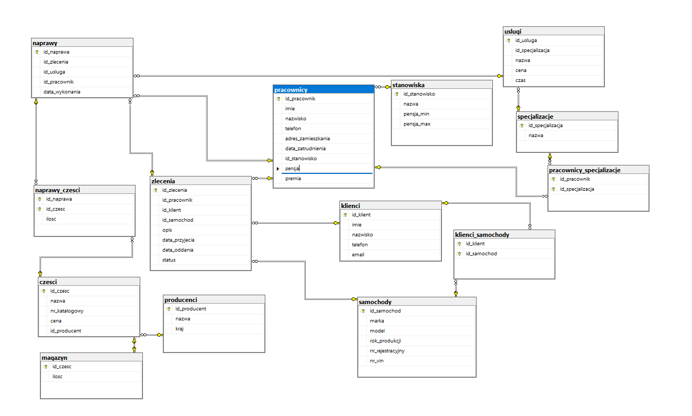

# Car Workshop Database – SQL Project

Academic SQL project prepared for the **Databases** course. The database models the work of a car workshop: clients, vehicles, employees, positions, specializations, services, repairs, spare parts and warehouse stock.

## Project scope

The project contains:

- database schema with **14 related tables**,
- primary keys and foreign keys,
- additional constraints such as `UNIQUE` and `CHECK`,
- many-to-many relations through junction tables,
- sample data for all main tables,
- **30 SQL queries** for reporting and data analysis,
- project documentation in PDF format.

## Technologies

- Microsoft SQL Server
- SQL Server Management Studio (SSMS)
- T-SQL
- Git
- GitHub

## Repository structure

```text
sql-practice/
├── README.md
├── .gitignore
├── database/
│   ├── 00_full_project.sql
│   ├── 01_schema.sql
│   ├── 02_insert_data.sql
│   └── 03_queries.sql
├── docs/
│   ├── sprawozdanie.pdf
│   └── wymagania_projektu.pdf
└── screenshots/
    └── diagram.png
```

## Database Diagram



## How to run the project

### Option 1 – run everything at once

Open SQL Server Management Studio and run:

```text
database/00_full_project.sql
```

This file creates the database, creates tables, inserts sample data and contains all analytical queries.

### Option 2 – run step by step

Run the scripts in this order:

```text
1. database/01_schema.sql
2. database/02_insert_data.sql
3. database/03_queries.sql
```

## Main tables

The project includes tables such as:

- klienci
- samochody
- klienci_samochody
- pracownicy
- stanowiska
- specjalizacje
- pracownicy_specjalizacje
- producenci
- czesci
- magazyn
- uslugi
- zlecenia
- naprawy
- naprawy_czesci

## Example query topics

The query file includes reports such as:

- clients with number of cars,
- active repair orders,
- repair completion time,
- repair report with mechanic and service cost,
- warehouse value,
- most frequently used parts,
- mechanics' performance,
- salary statistics by position,
- monthly repair revenue.

## Authors

- Patryk Dobrysiak-Pilch
- Zbigniew Łamaszewski
- Michał Młynarczyk

## Notes

This repository is prepared as part of an academic database project and may be used as a portfolio example showing SQL, relational database design and analytical queries.
